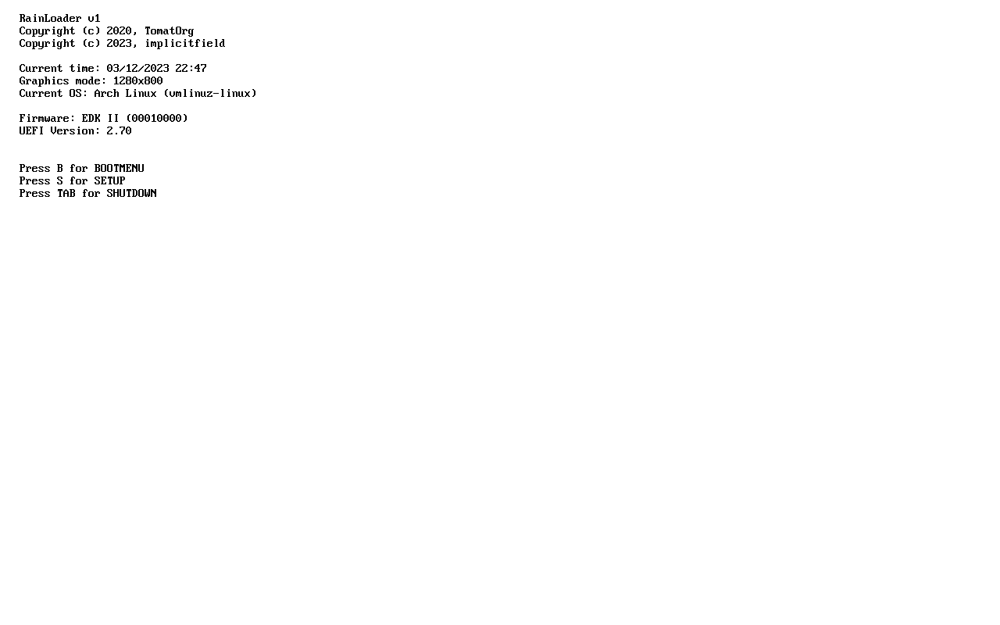

# RainLoader

RainLoader is a simple UEFI application designed for loading kernels.
This project is a fork of [TomatBoot](https://github.com/TomatOrg/TomatBoot), and as such is mostly compatible with it.



## Supported Boot Protocols

### Linux (`linux`)
Boots any relatively modern version of Linux with the help of EDK2's LoadLinuxLib.

### Multiboot2 (`mb2`)
The Multiboot2 loader allows loading any Multiboot2-compilant ELF kernel.

## Supported features
* Passing a kernel command line
* E820 & EFI Memory Maps
* ELF32/ELF64 Images + Elf Sections
* Framebuffer setup
* New/Old ACPI tables

### Building
Make sure you have a full LLVM toolchain installed (i.e. one that provides both `clang` and `lld-link`.)
Be sure to fetch the EDK2 submodule, and patch it with: `git apply fix-edk2-build.patch`.
To build the bootloader, run `make`.

The resulting binary will be saved as `bin/BOOTX64.EFI`.

### Creating an image
To create a bootable image you will need to have a GPT formatted image with one EFI FAT partition. You will 
need to save the bootloader as `EFI/BOOT/BOOTX64.EFI` in the EFI partition.

In order to boot a kernel, you will also need to provide a configuration file. See [CONFIG.md](CONFIG.md)
for details, and check out the [example config](config/example.cfg). The config file needs to be placed at
the root of the efi partition as `rainloader.cfg`.

Example directory structure for the UEFI partition:
```
.
├── EFI
│   └── BOOT
│       └── BOOTX64.EFI
├── rainloader.cfg
└── kernel.elf
```

### Developer notes

ELF loading:
* ELF loading is done with the help of EDK2's ElfLib.

EDK2:
* We use EDK2 headers/libraries without the EDK2 buildsystem for simplicity.
* To import a new file from EDK2, add its path to `edk2core.txt`.
* Errors regarding PcdGet can be resolved by adding the appropriate definition to the Makefile.
* NASM will not be accepted as a dependency. Follow the instructions in the next section to obtain GAS-style assembly.

Converting from NASM to GAS:
```
nasm -felf64 -O0 asm.nasm -o obj.o
llvm-objdump -d -j .text --triple=x86_64-elf64-none -Mintel obj.o > asm.S
```
NOTE: There may be more relevant sections than just `.text`. Check the nasm file if in doubt.
Clean up the output and add `.section`, `.global`, `.code32` and `.code64` directives where needed.
See [mb2.S](src/loaders/mb2/mb2.S) and [JumpToKernel.S](src/loaders/linux/JumpToKernel.S) for guidance on what the converted file should look like.
